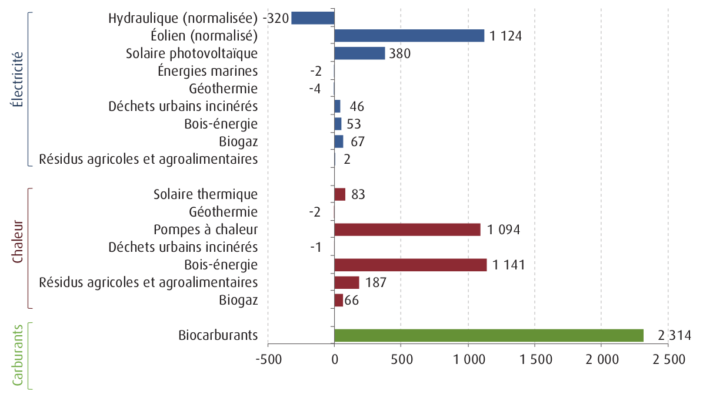

# En quête d'un biocarburant durable
# Controverses autour du projet de bioraffinerie de Total à la Mède

--------

## Une énergie renouvelable controversée

Les biocarburants constituent l’une des principales nouvelles énergies renouvelables à s’être développée au cours de la dernière décennie, dans le monde, en Europe et tout particulièrement en France (cf. le diagramme ci-dessous). Bien moins connus dans l’hexagone que l’éolien ou le photovoltaïque, les biocarburants y sont pourtant très présents, puisqu’ils représentent aujourd’hui plus de 7% de l’énergie consommée par les transports (contre 4% à l’échelle européenne) et que le leader mondial du biodiesel, le groupe Diester Industries (filiale de l’agro-industrie Avril), qui produit du gazole à partir de 80% du colza national, est français. Les carburants issus de la biomasse jouent donc un rôle essentiel pour atteindre les objectifs fixés en 2009 par le Paquet Énergie-Climat de la Commission Européenne, soit une part de 20% d’énergie renouvelable (23% pour la France) d’ici 2020.

Mais le développement des biocarburants a connu de vives controverses, notamment autour de l’année 2008, quand des rapports de l’OCDE et la FAO ont mis en avant leur rôle dans l’inflation des prix alimentaires, les accusant d’affamer le Tiers-Monde dans une logique “Fuel versus Food”. Des bilans environnementaux très contradictoires ont été produit pour mesurer le réel impact de cette énergie renouvelable. Les analyses dites de cycle de vie, qui permettent de mesurer les émissions et la consommation énergétique dépensée, de la plantation à la pompe, pour produire un litre de biocarburants, varient énormément entre différentes filières (bioéthanol issu du maïs, biodiesel issu du colza ou d’importations d’huiles de palmes, biocarburants de deuxième génération produits à partir des parties non comestibles de végétaux, de déchets, à partir de microalgues…) mais aussi dans leurs méthodes de mesure même. Fortement incitatrice dans ses politiques de développement des biocarburants, la Commission européenne, alertée par des rapports de recherche et des mobilisations de la société civile, a proposé en 2009 puis en 2015, au fil de plusieurs directives, des critères permettant de définir - et certifier - des biocarburants durables, afin de limiter la part de ceux dits à l’inverse classiques ou conventionnels et qui ne recevraient plus d’aide (seuil maximum d’incorporation dans les carburants fixé à 7% soit la situation de la France, qui a fortement oeuvré en coulisses pour que le Parlement européen ne descende pas en dessous de ce niveau). 

Ces critères, vérifiés par des organismes certificateurs, sont aujourd’hui les suivants : 
- d’un point de vue quantitatif, les biocarburants doivent permettre une réduction des émissions de gaz à effet de serre (du puits à la roue) d’au moins 35% par rapport aux carburants fossiles de référence et, à partir du 1er janvier 2017, d’au moins 50%, voire de 60% en 2018 pour les unités nouvelles.
- selon des critères qualitatifs, dits « critères liés aux terres », les biocarburants ne doivent pas être produits à partir de terres riches en biodiversité et des terres présentant un important stock de carbone ou de tourbières.

Ces critères ainsi que la mise en oeuvre du processus de certification sont dénoncés par certains organismes (des ONG, mais aussi la Cour des Comptes européenne, cf. les ressources ci-dessous) qui y voient une procédure de greenwashing en attribuant la qualification de durable à des productions nocives, voire néfastes ; du côté des industriels producteurs de biocarburants, on rappelle le nombre d’emplois agricoles et ruraux à la clef, et on conteste les méthodologies encore fragiles employées, tout en soulignant que les biocarburants constituent la seule source d’énergie renouvelable liquide, utilisable et utilisée à grande échelle pour les transports. Certains acteurs préfèrent investir la seconde génération de biocarburants issue de la lignocellulose des branches et tiges de taillis, mais leurs procédés techniquement encore incertains doivent aussi répondre à la problématique des changements d’affectation des sols indirects - soit l’utilisation de terres arables pour produire des biocarburants qui conduirait à une déforestation ailleurs, afin de compenser la pénurie de terres disponibles.

C’est dans ce contexte difficile, qui mixe des enjeux à la fois énergétiques, environnementaux, agricoles et alimentaires, que la Direction Énergie de la Commission Européenne enclenche une procédure de consultation des parties prenantes, pour définir une nouvelle politique de durabilité des biocarburants à l’horizon post-2020. Alors que certains biocarburants, tels ceux issus d'huile de palme, sont amenés à disparaître d'ici 2021, un projet de bioraffinerie sur la plateforme Total de la Mède utilisant cette ressource concentre aujourd'hui des prises de positions contradictoires.

## Le projet de bioraffinerie de Total à la Mède

